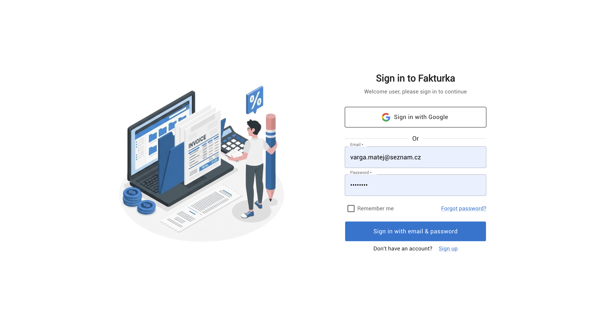
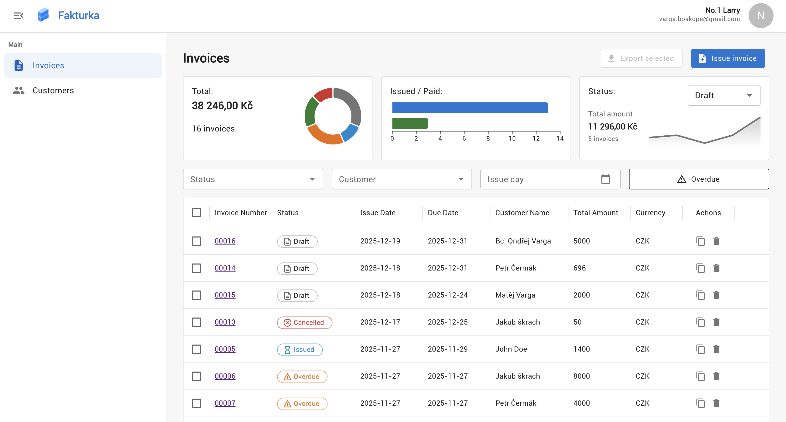
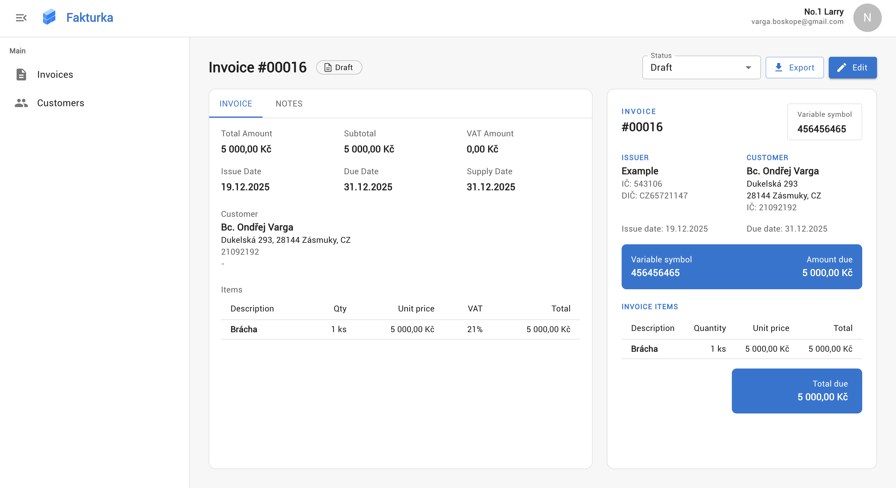
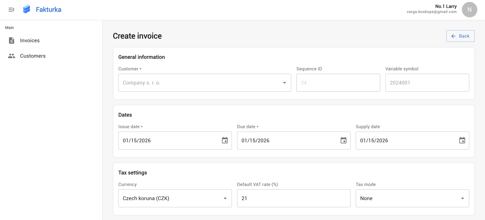
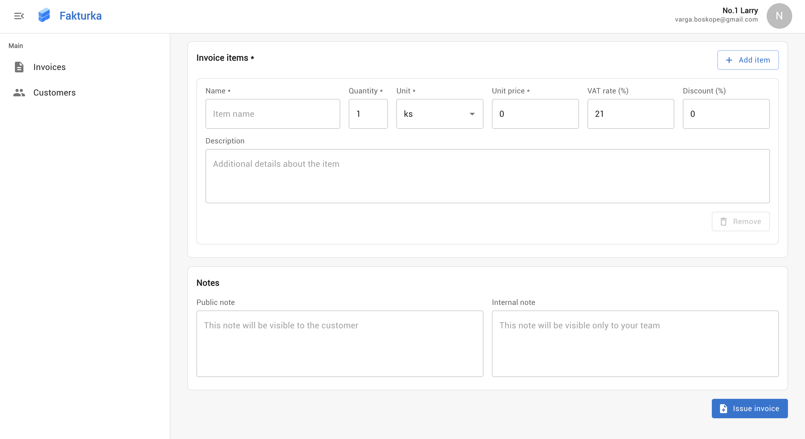
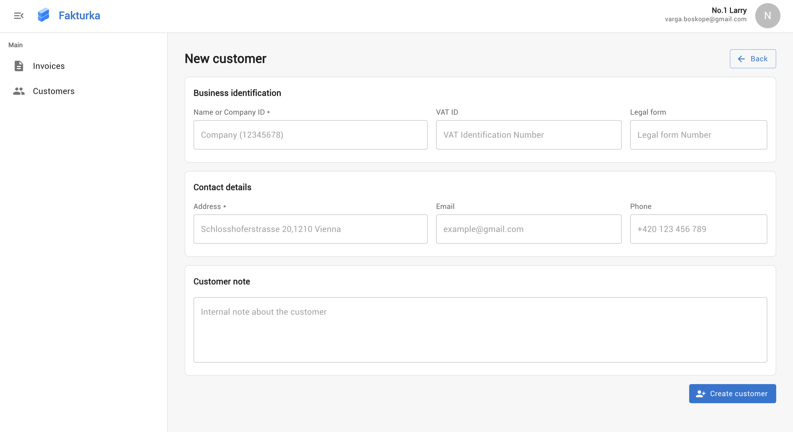

# Fakturka – uživatelská příručka

Tento dokument slouží jako kompletní průvodce pro běžného uživatele aplikace Fakturka. Najdete zde přehled všech dostupných funkcí – od prvního přihlášení až po práci s fakturami, zákazníky a osobními nastaveními.

---

## 1. Přihlášení, registrace a zapomenuté heslo

- **Registrace:** Na stránce `Sign up` vyplňte jméno, příjmení, e‑mail a heslo. Po potvrzení je účet ihned aktivní.
- **Přihlášení:** Na stránce `Sign in` můžete použít:
  - klasické přihlášení e‑mailem a heslem (s volbou „Remember me“),
  - nebo přímé přihlášení přes Google (OAuth).
- **Obnova hesla:** V případě zapomenutého hesla klikněte na „Forgot password?“. Stačí zadat registrovaný e‑mail – přijde vám nové heslo a budete přesměrováni zpět na přihlašovací stránku.

> Tip: Po úspěšném resetu se na přihlašovací stránce zobrazí potvrzení, že bylo nové heslo odesláno.

---

## 2. Navigace v aplikaci

Po přihlášení se zobrazí hlavní rozhraní Toolpad App Provideru se dvěma hlavními sekcemi:

1. **Invoices** – dashboard, seznam faktur, vystavení a správa jednotlivých dokumentů.
2. **Customers** – přehled odběratelů, jejich editace a tvorba nových kontaktů.

V horní části aplikace je dostupné uživatelské menu s odkazy na:
- **Profile** – detail účtu a firemních údajů,
- **Settings** – osobní předvolby (například výchozí měna),
- případně další stránky, které jsou na projektu povolené (např. `Settings`, `Profile`).

---

## 3. Dashboard faktur

Sekce **Invoices** se skládá ze tří částí:

1. **Akční lišta**
   - tlačítko **„Issue invoice“** vás přesměruje na formulář pro vystavení nové faktury,
   - tlačítko **„Export selected“** (nebo ikonka v mobilním zobrazení) umožňuje stáhnout vybrané faktury jako ZIP archiv s PDF soubory.

2. **Dashboardové grafy**
   - přehled celkové částky fakturováno, počtu faktur a rozdělení podle stavů,
   - graf „Issued / Paid“ pro rychlý přehled cash‑flow,
   - minigraf se statistikou vybraného stavu (volíte v comboboxu se stejnými barevnými ikonami, jaké se používají ve filtrech a detailech).

3. **Datagrid faktur**
   - zobrazuje seznam s možností stránkování, řazení a vícenásobného výběru,
   - sloupec „Actions“ nabízí rychlé **duplikování** a **mazání** faktury (mazat lze pouze koncepty),
   - kliknutí na číslo faktury otevře detail.

### 3.1 Filtrovací panel

Nad datagridem najdete toolbar s následujícími filtry:
- **Status** – barevně označený výběr stavu faktury (Draft, Issued, Sent, Overdue, Paid, Cancelled).
- **Customer** – automatické doplňování podle názvu odběratele.
- **Issue Date** – filtr na konkrétní datum (volíte pomocí kalendáře).
- **Overdue** – přepínač, který okamžitě odkryje pouze faktury po splatnosti.

Každá změna filtru automaticky obnoví data a přepne stránkování na první stránku.

---

## 4. Detail faktury

Po kliknutí na řádek v seznamu se zobrazí **Invoices Detail**:

- horní lišta obsahuje číslo faktury, barevný štítek stavu a **kombobox se stavem**. Jakmile vyberete jiný stav, odešle se okamžitě požadavek na backend (přes PUT `/api/invoices/{id}`) a stav se aktualizuje jak v detailu, tak v seznamu.
- tlačítko **„Export“** spustí generování PDF a stáhne soubor,
- tlačítko **„Edit“** otevře formulář pro úpravu (povoleno pouze pro drafty).

### Další obsah
- **Základní přehled** – souhrnné částky, data vystavení/splatnosti/dodanění.
- **Sekce „Invoice“** – detail odběratele, položek a sazeb.
- **Sekce „Notes“** – veřejné i interní poznámky.
- **Postranní panel** – náhled PDF-like layoutu faktury (včetně položek a souhrnů).

Statusové změny jsou potvrzovány alerty a je možné je znovu načíst (automaticky se volá `refetch()`).

---

## 5. Vystavení a editace faktury

Stránka **InvoicesForm** slouží jak pro novou fakturu, tak pro editaci nebo duplikaci:

- formulář je rozdělen na logické sekce (základní údaje, odběratel, položky, poznámky),
- termíny (Issue/Due/Supply Date) se vybírají kalendářem,
- pro položky je k dispozici dynamická tabulka se jménem, popisem, množstvím, jednotkou, cenou, DPH a slevou,
- součty (subtotal, VAT, total) se přepočítají po odeslání,
- duplikaci spustíte z datagridu pomocí akce „Duplicate“ – otevře se formulář s předvyplněnými daty,
- uložením se odešle POST (nová faktura) nebo PUT (editace) na `/api/invoices`.

> Poznámka: Úpravy existující faktury jsou možné pouze v stavu **Draft**. Změna stavu u již vystavených faktur se řeší přímo v detailu přes status combobox.

---

## 6. Hromadný export

Vyberte v datagridu jednu nebo více faktur (checkbox vlevo), klikněte na „Export selected“ a:
- aplikace postupně stáhne jednotlivé PDF (přes chráněné `/export-file`),
- zabalí je do ZIPu pomocí JSZip,
- stáhne archiv s názvem `invoices-{timestamp}.zip`.

Během exportu je tlačítko deaktivované a vidíte stav „Exporting…“.

---

## 7. Zákazníci

Sekce **Customers** obsahuje:

- **Přehled** – datagrid se seznamem odběratelů, stránkováním a řazením.
- **Akce** – rychlá editace (otevře formulář) a delete s potvrzením.
- **Tlačítko „Add Customer“** – otevře **CustomersForm**.

### CustomersForm
- formulář pro základní údaje zákazníka (název, IČO, DIČ, kontakty, adresa),
- integrace na **ARES**:
  - nad seznamem je vyhledávací pole (funguje od 3 znaků),
  - lze vybrat položku z autocomplete,
  - tlačítkem vedle pole načtete detail z ARESu a předvyplní se název, adresa, identifikátory.
- Uložení (create i update) probíhá přes `/api/customers`.

---

## 8. Profil uživatele

Na stránce **Profile** můžete:
- zobrazit přehled svých rolí (značeno štítky),
- spravovat osobní údaje (jméno, e‑mail), firemní název, IČO, DIČ, stav plátce DPH,
- nastavit avatar URL,
- formulář používá validaci (např. povinné jméno/e‑mail, validní e‑mail),
- tlačítka „Save“ a „Reset“ umožňují změny uložit nebo vrátit do stavu načteného z backendu.

---

## 9. Nastavení (Settings)

V sekci **Settings** se aktuálně spravuje výchozí měna:
- combobox nabízí všechny podporované měny (`CURRENCY_OPTIONS`),
- vybraná hodnota se ukládá do Redux store (`settingsSlice`) a ovlivňuje například dashboardové přepočty částek.

---

## 10. Další tipy a chování aplikace

- **Responzivní design:** Datagridy mají horizontální scroll, takže lze pracovat i na menších obrazovkách.
- **Bezpečnost:** Každý požadavek využívá JWT token – při vypršení platnosti je uživatel automaticky odhlášen.
- **Notifikace:** Chybové stavy (např. neúspěšný export, neuložený formulář) se zobrazují pomocí `Alert` komponenty.
- **Mazání:** Faktury i zákazníci jsou mazáni přes potvrzovací dialog `ConfirmDialog`, takže nehrozí náhodné odstranění.
- **Duplicity:** Duplikací faktury lze rychle vystavit novou fakturu na stejného odběratele s identickými položkami – stačí upravit termíny a částku.

---

## 11. Shrnutí pracovního toku

1. **Zaregistrujte se** nebo se přihlaste (případně využijte Google).
2. **Vytvořte zákazníka** – ručně, nebo si pomozte ARES vyhledáváním.
3. **Vystavte fakturu** – vyplňte údaje, položky, zkontrolujte náhled.
4. **Sledujte stav** – v dashboardu i detailu vidíte barevně odlišené stavy, můžete je měnit.
5. **Exportujte PDF** – jednotlivě z detailu nebo hromadně ze seznamu.
6. **Spravujte profil a nastavení**, aby odpovídala firemním údajům a preferencím.

Tímto způsobem získáte ucelený přehled o celém fakturačním procesu v aplikaci Fakturka. Pokud budete potřebovat doplnit novou funkčnost, inspirujte se také technickou dokumentací (`tech-documentation.md`), která popisuje architekturu a API rozhraní.

---

Máte-li další dotazy k používání aplikace, doporučujeme obrátit se na tým, který projekt spravuje – v rámci zdrojového kódu naleznete všechny potřebné informace pro rozšíření i podporu. Přejeme příjemnou práci s Fakturkou!
